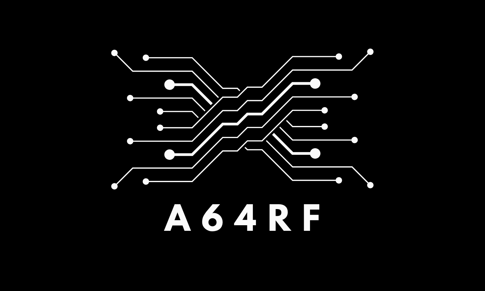

<p align="center">
    
</p>

# 🚀 **A64RF: ARMv8-A Register Playground**
**A64RF** is a minimal and experimental framework for quickly emulating ARM64 instructions and inspecting CPU register state snapshots. Designed for developers and researchers interested in low-level ARMv8-A assembly programming, debugging, and performance analysis.

---

## ✨ Key Features

* **Lightweight Snapshotting**: Efficiently capture and inspect general-purpose and NEON vector register states.
* **Instruction Emulation**: Basic support for ARMv8-A instruction emulation with an easy-to-use API.
* **Assembly Integration**: Simple macros provided for convenient integration within assembly code.
* **Portability**: Entirely written in pure C, ensuring easy integration and portability across various platforms.

---

## 📌 Quick Start

### 1. Emulator Example

Clone the repository and run examples:

```bash
git clone https://github.com/yourname/a64rf.git
cd a64rf/tests
gcc -I../include example000.c -o example000
./example000
```

Sample Output:

```
=== GPR value (hex / dec / oct) ===
X0 = 0xf23456789abcdef0
X0 = -994074541749903632
X0 = 0o1710642547423257157360

=== Vector register interpret as {2D,4S,8H,16B} ===
V0: d[0] = 0xaa55aa55aa55aa55, d[1] = 0x55aa55aa55aa55aa
V0: s[0] = 0xaa55aa55, s[1] = 0xaa55aa55, s[2] = 0x55aa55aa, s[3] = 0x55aa55aa
V0: h[0]=0xaa55, h[1]=0xaa55, h[2]=0xaa55, h[3]=0xaa55, h[4]=0x55aa, h[5]=0x55aa, h[6]=0x55aa, h[7]=0x55aa
V0: b[0]=0x55, b[1]=0xaa, b[2]=0x55, b[3]=0xaa, b[4]=0x55, b[5]=0xaa, b[6]=0x55, b[7]=0xaa, b[8]=0xaa, b[9]=0x55, b[10]=0xaa, b[11]=0x55, b[12]=0xaa, b[13]=0x55, b[14]=0xaa, b[15]=0x55

=== ADDS & flag demo ===
X0 = 0xf23456789abcdef0
X1 = 0xffedcba987654321
NZCV = N:0 Z:0 C:0 V:0

=== PERFORM ADDS X2, X0, X1 ===
X2 = 0xf222222222222211
NZCV = N:1 Z:0 C:1 V:0

=== PERFORM SUBS XZR, X2, X2 ===
NZCV = N:0 Z:1 C:1 V:0
```

### 2. Assembly Snapshot Example

Define macro for large immediate move:

```assembly
#define movbig(nn,n3,n2,n1,n0)        \
        movz    nn, n0                \
        movk    nn, n1, lsl #16       \
        movk    nn, n2, lsl #32       \
        movk    nn, n3, lsl #48
```

Insert snapshot macros into assembly code:

```assembly
#ifdef A64RF_TRACE
    SNAP_REGS 2, 1               /* Snapshot before modification */
#endif
    movbig(x10, 0xa0f9, 0x9e23, 0x7502, 0x2099)
    movbig(x11, 0xa8c6, 0x8f3f, 0x1d13, 0x2595)
    movbig(x12, 0x6c6c, 0x8938, 0x05ac, 0x5242)
    movbig(x13, 0x2765, 0x08b2, 0x4177, 0x0615)
#ifdef A64RF_TRACE
    SNAP_REGS 3, 1               /* Snapshot after modification */
#endif
```

Sample Snapshot Output:

```
[S2 A]
X10 = 0x0000000000000002
X11 = 0x0000010000000000
X12 = 0x00000000fffffffd
X13 = 0x0000000000000000
...

[S3 A]
X10 = 0xa0f99e2375022099
X11 = 0xa8c68f3f1d132595
X12 = 0x6c6c893805ac5242
X13 = 0x276508b241770615
...
```

> **Note:** The `movbig` macro definition and the demo asm was adapted from the [AWS s2n bignum library](https://github.com/awslabs/s2n-bignum.git). Thanks to AWS and the open-source community for sharing valuable resources.

> ⚠️ **Note:** Automated testing is not yet fully implemented; current testing relies on manual verification.

---

## 🗂️ Project Structure

```
a64rf/
├── include/    # Public API headers
├── src/        # Core snapshot and emulation implementations
├── tests/      # Example programs for manual testing
└── asm.S       # Demonstration of assembly macro usage
```

---

## 🚧 Current Status and Roadmap

The project is currently experimental:

* ✅ Snapshot and register dump functionalities are stable.
* 🚧 Instruction emulation features are partially complete and under active development.
* 🚧 Automated testing infrastructure (potentially involving QEMU integration) is planned but not yet implemented.

---

## 🤝 How to Contribute

Formal contribution guidelines are not yet available, but your help is highly appreciated:

* Report bugs or suggest improvements via GitHub Issues.
* Submit Pull Requests for enhancements or fixes.
* Reach out if you have experience with automated testing or QEMU integration.

---

## License

This project is licensed under the MIT License - see the [LICENSE](LICENSE) file for details.


---

Feel free to explore, test, and provide feedback—your insights will greatly enhance this project's growth!
